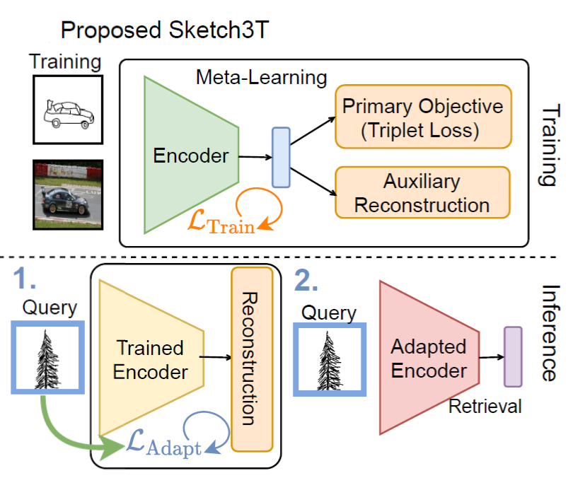
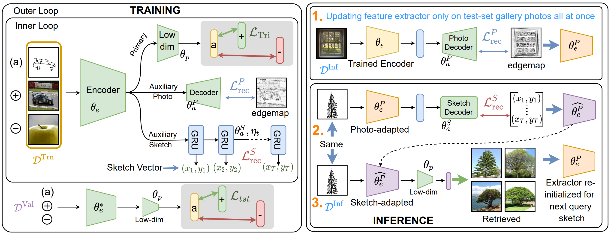
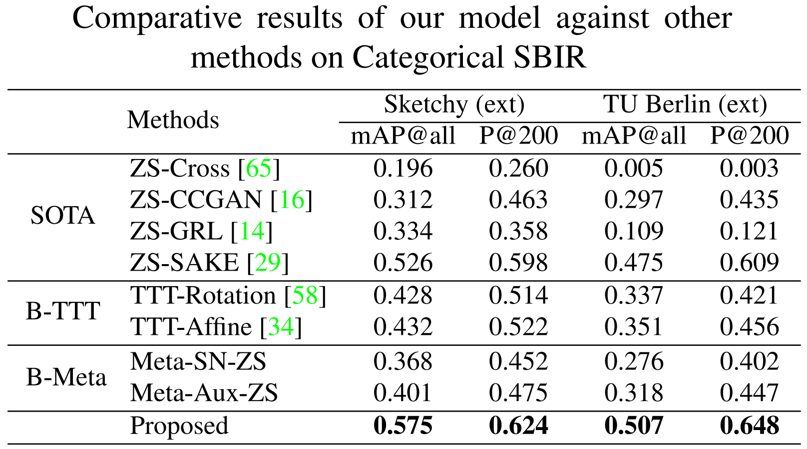
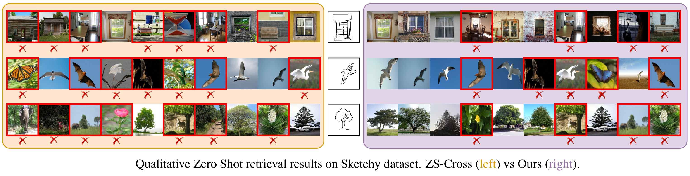
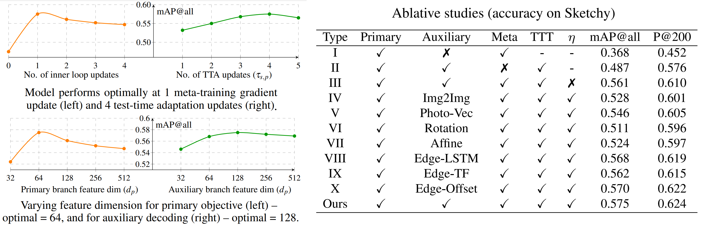

# [Sketch3T: Test-Time Training for Zero-Shot SBIR](https://aneeshan95.github.io/Sketch3T/)
#### [Paper](https://arxiv.org/pdf/2203.14691/pdf) accepted in CVPR 2022. 

# Abstract
Zero-shot sketch-based image retrieval typically asks for a trained model to be applied as is to unseen categories. In this paper, we question to argue that this setup by definition is not compatible with the inherent abstract and subjective nature of sketches – the model might transfer well to new categories, but will not understand sketches existing in different test-time distribution as a result. We thus extend ZS-SBIR asking it to transfer to both categories and sketch distributions. Our key contribution is a test-time training paradigm that can adapt using just one sketch. Since there is no paired photo, we make use of a sketch raster-vector reconstruction module as a self-supervised auxiliary task. To maintain the fidelity of the trained cross-modal joint embedding during test-time update, we design a novel metalearning based training paradigm to learn a separation between model updates incurred by this auxiliary task from those off the primary objective of discriminative learning. Extensive experiments show our model to outperform stateof-the-arts, thanks to the proposed test-time adaption that not only transfers to new categories but also accommodates to new sketching styles.

# Illustration

Normal ZS-SBIR methods obtain lower accuracies as they retrieve from unseen data using model weights trained on seen data. During inference, our model (Sketch3T) adapts to the test distribution via an auxiliary task, before retrieval, scoring better.
 
# Framework

Our Framework. Our model is trained (left) on primary and auxiliary tasks, meta-learning stroke-weights. During inference (right) the model first updates (optionally) on the test-set photo distribution, followed by sketch-specific test-time training for retrieval.

## Implementation
* We used TUBerlin (ext) and Sketchy(ext) for categorical SBIR. Please read the [paper](https://arxiv.org/pdf/2203.14691/pdf) for details.

# Results




#Ablative Studies


## Code : The code for this project shall be uploaded soon.

# Citation
If you find this article useful in your research, please consider citing:

```
@inproceedings{stylemeup,
author = {Aneeshan Sain and Ayan Kumar Bhunia Vaishnav Potlapalli and Pinaki Nath Chowdhury and Tao Xiang and Yi-Zhe Song},
title = {Sketch3T: Test-Time Training for Zero-Shot SBIR},
booktitle = {CVPR},
year = {2022}
}
```
